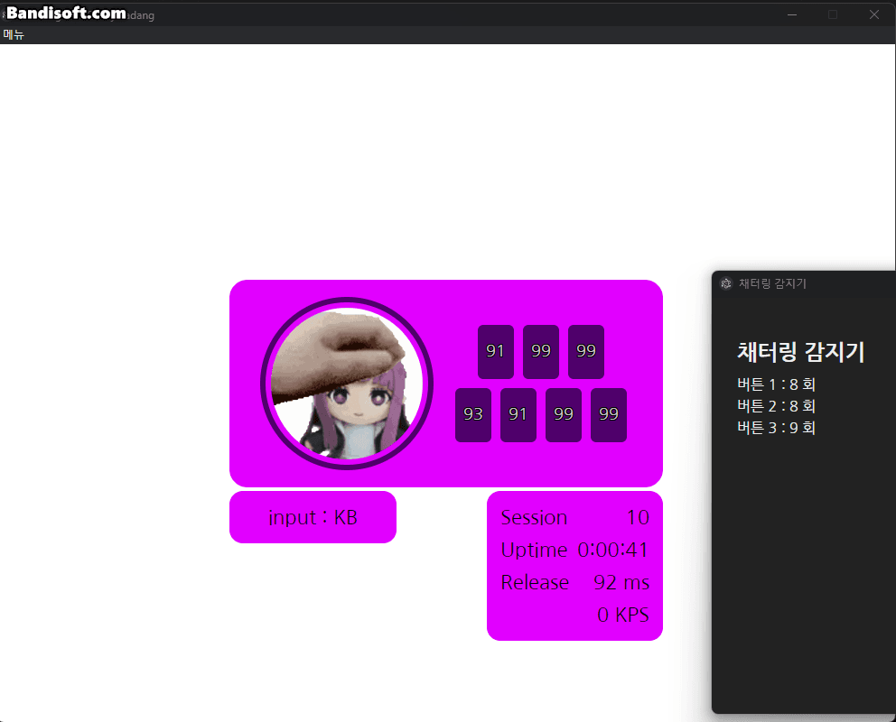

# IIDXwidget

🎵 **IIDXwidget**은  
[Rag](https://rag-oji.com/dakendisplay/) 님이 만든 방송용 투덱 위젯을 참고하여,  
**OBS 브라우저 소스**로 쉽게 불러올 수 있도록 개발한 **투덱 방송용 위젯 프로젝트**입니다.  
**투컴 방송** 환경에서도 사용할 수 있도록 설계되었습니다.

- **개발자** : [BMS Sadang](https://www.youtube.com/@Sadang)
- **라이센스** : MIT License (이 패키지에 포함된 소프트웨어들의 라이센스 명시는 [LICENCES](https://github.com/Coldlapse/IIDXwidget/blob/main/LICENCES)를 참고하세요.)
- **후원** : https://toon.at/donate/Sadang (제 개인방송 도네 링크입니다.)

---

## 기능

- 스크래치의 입력 방향과 버튼 입력을 실시간으로 시각화하여 보여줍니다.
- 버튼이 눌렸다가 떼지는 데에 소요된 시간을 ms 단위로 측정하여 평균을 내줍니다. 커스터마이징을 지원하며, 이동평균 수치가 높을 수록 변화에 둔해집니다. 기본값은 200입니다.
- 현재 피닉스완(주작콘), FPS 2세대 및 키보드 입력을 지원합니다. LR2 모드도 지원합니다.
- 채터링(이중 인식) 감지를 지원합니다. 떼는 시간이 15ms 아래인 경우, 이중 인식으로 기록합니다. 메뉴에서 확인 가능합니다.
- 위젯 각 요소의 색상 커스터마이징과 턴테이블 커스터마이징을 지원합니다.
---
## 사용 방법

1. 📦 설치 파일 실행  

   - Release에 업로드된 설치 파일을 다운로드하여 설치한 뒤 실행합니다.

2. 🌐 OBS에 브라우저 소스 추가

   - **원컴 방송**이라면:  
     `http://127.0.0.1:8080/widget/`
   - **투컴 방송**이라면:  
     `http://[리듬 게임 실행 컴퓨터의 IP]:8080/widget/`
   을 OBS의 **브라우저 소스**로 추가합니다. 
   - 이 때, 포트는 설정에서 커스터마이징이 가능합니다. 기본값은 8080입니다.
   - 너비와 높이는 800*600 입력을 권장합니다.

3. 🎮 방송 시작
   - 즐겜하세요! 성과 많이 뽑으세요 😊

---

## 업데이트 이력

- 0.1.0 : 최초 릴리즈 ([패치 내역](https://github.com/Coldlapse/IIDXwidget/releases/tag/v0.1.0))
- 1.0.0 : 정식 출시 (심각한 버그로 인해 v1.0.1을 바로 게시했습니다.) ([패치 내역](https://github.com/Coldlapse/IIDXwidget/releases/tag/v1.0.0))
- 1.0.1 : 설정값이 저장 안되던 문제 해결 ([패치 내역](https://github.com/Coldlapse/IIDXwidget/releases/tag/v1.0.1))
- 1.0.2 : KB만 설정값이 저장 안되던 문제 해결 ([패치 내역](https://github.com/Coldlapse/IIDXwidget/releases/tag/v1.0.2))
- 1.0.3 : KB 모드 특수키 입력 매핑 추가 (기여자 : rhombus9) ([패치 내역](https://github.com/Coldlapse/IIDXwidget/releases/tag/v1.0.3))
- 1.1.0 : 자동 업데이트 구현을 위한 중간 버전 ([패치 내역](https://github.com/Coldlapse/IIDXwidget/releases/tag/v1.1.0))
- 1.1.1 : 자동 업데이트 구현을 위한 중간 버전 ([패치 내역](https://github.com/Coldlapse/IIDXwidget/releases/tag/v1.1.1))
- 1.2.0 : 자동 업데이터 구현 및 LR2 인식 추가 등등 ([패치 내역](https://github.com/Coldlapse/IIDXwidget/releases/tag/v1.2.0))
- 1.2.1 : 10만번 이상 두들겨도 줄 바꿈 일어나지 않게 수정 ([패치 내역](https://github.com/Coldlapse/IIDXwidget/releases/tag/v1.2.1))
- 2.0.0 : 위젯 커스터마이징 추가, 이동평균 수치 조정 추가, 채터링 감지 기능 추가 ([패치 내역](https://github.com/Coldlapse/IIDXwidget/releases/tag/v2.0.0))

---

## TODO
- beatmania.app 서열표 사이트와 연계하여, 매일 입력한 버튼 수 통계 보는 기능 추가 (DB 작업 필요)