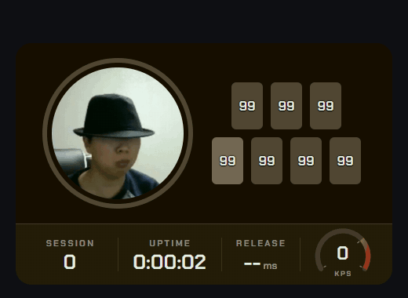
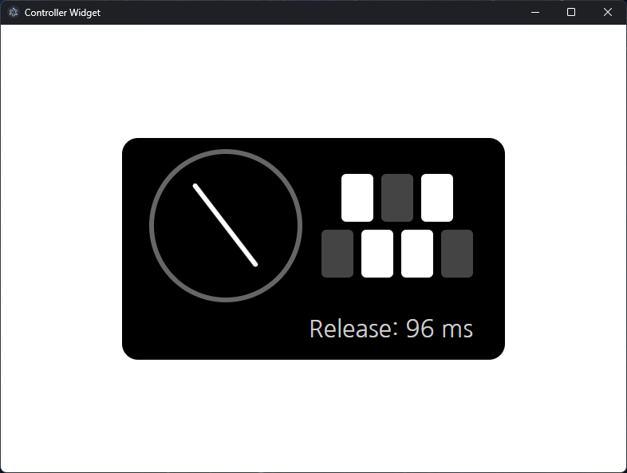
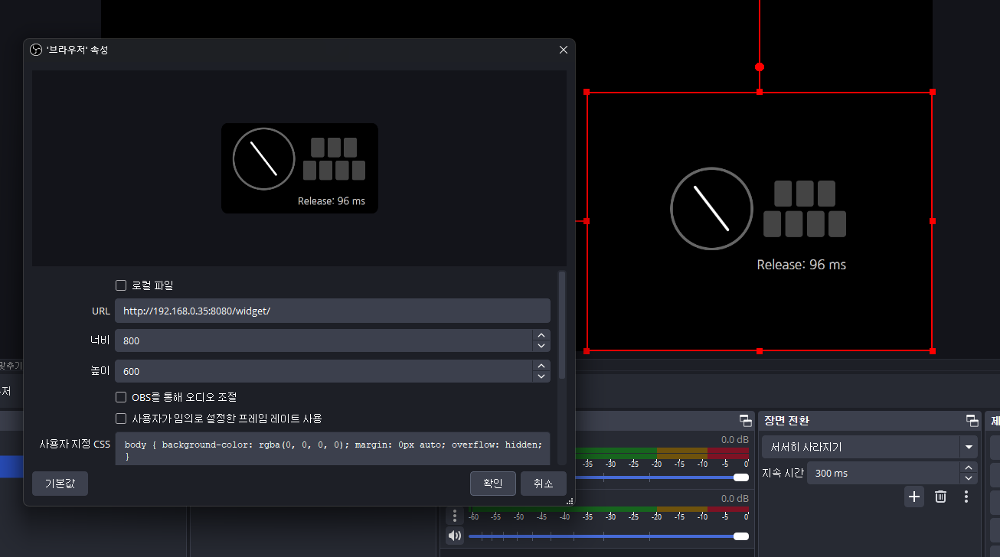

# IIDXwidget

🎵 **IIDXwidget**은  
[Rag](https://rag-oji.com/dakendisplay/) 님이 만든 방송용 투덱 위젯을 참고하여,  
**OBS 브라우저 소스**로 쉽게 불러올 수 있도록 개발한 **투덱 방송용 위젯 프로젝트**입니다.  
**투컴 방송** 환경에서도 사용할 수 있도록 설계되었습니다.

- **다운로드** : [Releases](https://github.com/Coldlapse/IIDXwidget/releases/latest)
- **라이센스** : MIT License
- **후원** : [Buy Me a Coffee](https://buymeacoffee.com/sadang)

---

## 📖 가이드

앱 안에서도 상단 메뉴 → **가이드**에서 볼 수 있습니다.

- 🔌 [연결 가이드](./GUIDE/CONNECTION.md) : OBS에 위젯을 띄우는 방법. 원컴/투컴, IP 찾는 법까지 처음부터 설명합니다. **처음이라면 여기부터!**
- 📘 [사용법과 설정](./GUIDE/USAGE.md) : 화면 구성, 메뉴, 각 설정이 무엇을 뜻하는지
- ⏱ [RELEASE 수치](./GUIDE/RELEASE.md) : 건반 위 숫자와 평균 릴리즈가 뜻하는 것, 계산 방식 (Rag 님 위젯과 동일)
- 🔍 [채터링 감지](./GUIDE/CHATTER.md) : 채터링(이중 인식)을 어떻게 세는지, 감지 방식(Rag / Sadang), 게임별 입력 처리, 숫자가 높을 때 할 일

2.x에서 업데이트하셨다면 👉 [3.0.0 업데이트 안내](./GUIDE/WHATSNEW.md) (바뀐 점, OBS 새로고침 방법). 업데이트 후 앱을 처음 켤 때도 자동으로 열립니다.

English guides: [What's new in 3.0.0](./GUIDE/WHATSNEW.en.md) · [Connection](./GUIDE/CONNECTION.en.md) · [Usage](./GUIDE/USAGE.en.md) · [Release](./GUIDE/RELEASE.en.md) · [Chatter](./GUIDE/CHATTER.en.md)

---

## 기능

- 스크래치의 입력 방향과 버튼 입력을 실시간으로 시각화하여 보여줍니다.
- 버튼이 눌렸다가 떼지는 데에 소요된 시간(릴리즈)을 ms 단위로 측정하여 평균을 내줍니다. 계산 방식은 [Rag](https://rag-oji.com/dakendisplay/) 님 위젯과 동일하게 설정했습니다.
  - 전체 평균은 최근 2000개, 건반별 평균은 최근 300개 입력 기준입니다. (설정에서 조정 가능)
  - 롱노트(CN)로 누른 입력(기본 200ms 이상)과 255ms 이상은 평균에서 뺍니다. 롱노트로 누르고 있는 건반은 다른 색으로 표시됩니다.
- 세션 정보(타건 수, 업타임, 평균 릴리즈, KPS)를 위젯 위나 아래에 표시합니다. 모든 숫자는 앱을 켤 때 0부터 시작하는 **세션** 기준이고, 앱 창과 OBS 위젯은 항상 같은 숫자를 보여줍니다.
- 피닉스완(주작콘), FPS EMP 2세대, 키보드 입력을 지원합니다. LR2 모드도 지원합니다.
- 그 밖의 컨트롤러나 자작 기판은 **그 외 컨트롤러**로 연결한 뒤, 버튼을 눌러 직접 매핑할 수 있습니다.
- 채터링(이중 인식) 감지를 지원합니다. 뗀 뒤 같은 건반을 다시 누르기까지의 간격으로 판단하며, 메뉴 → **채터링 감지**에서 건반별로 확인할 수 있습니다. 창을 닫아 두어도 계속 집계합니다.
  - 감지 방식은 두 가지입니다. **Rag** (기본, 30ms 미만 전부) / **Sadang** (10ms 초과 30ms 미만만, 게임이 걸러 내는 짧은 떨림은 제외). 기준은 채터링 감지 창의 ⚙ 설정에서 바꿀 수 있습니다. 자세한 내용은 [채터링 감지 가이드](./GUIDE/CHATTER.md)를 참고하세요.
- 위젯 커스터마이징
  - 각 요소의 색상 (롱노트로 누르고 있는 건반 색 포함), 위젯 배경 투명하게 하기, 건반 위 릴리즈 수치 표시/숨기기
  - 스크래치 커스텀 이미지: 1장, 또는 회전 방향에 따라 바뀌는 2장
  - 1P / 2P 버튼 배치, 세션 정보 위치(상단 / 하단 / 숨김)
- 설정을 바꾸면 OBS 위젯에 바로 반영됩니다. 앱을 껐다 켜도 OBS 위젯이 알아서 다시 연결되며, 이때 숫자는 새 세션으로 0부터 시작합니다.
- 한국어 / English 를 지원합니다. (메뉴 → Language)
- [beatmania.app](https://beatmania.app) 서열표 사이트로 타건 기록을 전송할 수 있습니다. (메뉴 → **세션 기록** → 지금 전송)
  - 이번 세션에서 아직 보내지 않은 양만 보내므로 여러 번 눌러도 중복되지 않습니다.
  - 설정에서 **종료할 때 남은 타건 기록 자동 전송**을 켜면, 앱을 끌 때 남은 양을 자동으로 보냅니다. (기본값은 꺼짐) 켜지 않았다면 앱을 끌 때 보내지 않은 양은 사라집니다.
  - 날짜별 기록은 beatmania.app 마이페이지에서 볼 수 있습니다. 서버는 전송을 받은 시각(한국 시간) 기준으로 날짜를 나눕니다.
- 새 버전이 나오면 앱에서 자동으로 알려줍니다.

---

## 사용 방법

1. 📦 설치 파일 실행  

   - [Releases](https://github.com/Coldlapse/IIDXwidget/releases/latest)에 업로드된 설치 파일(`IIDXwidget-Setup-x.x.x.exe`)을 다운로드하여 설치한 뒤 실행합니다.
   - 백신이나 Windows 경고가 뜬다면 아래 [백신 경고가 뜰 때](#-백신-경고가-뜰-때)를 참고하세요.

2. 🌐 OBS에 브라우저 소스 추가

   - **원컴 방송**이라면:  
     `http://127.0.0.1:8080/widget/`
   - **투컴 방송**이라면:  
     `http://[리듬 게임 실행 컴퓨터의 IP]:8080/widget/`
   을 OBS의 **브라우저 소스**로 추가합니다. 
   - 이 때, 포트는 설정에서 커스터마이징이 가능합니다. 기본값은 8080입니다.
   - 너비와 높이는 800*600 입력을 권장합니다.
   - 투컴 방송이라면, 앱을 처음 실행할 때 뜨는 Windows 방화벽 창에서 **허용**을 눌러주세요.
   - IP가 뭔지, 어떻게 찾는지 모르겠다면 [연결 가이드](./GUIDE/CONNECTION.md)를 보세요. 앱을 처음 실행하면 이 가이드가 자동으로 열립니다.

3. ⚙️ 컨트롤러 설정
   - 메뉴 → **설정**에서 사용하는 컨트롤러 프로필을 고르고 저장합니다. 자세한 내용은 아래 [컨트롤러 설정](#-컨트롤러-설정)을 참고하세요.

4. 🎮 방송 시작
   - 즐겜하세요! 성과 많이 뽑으세요 😊

---

## 🎛 컨트롤러 설정

- **피닉스완(주작콘) / FPS EMP 2세대**
  - 프로필만 고르면 바로 인식됩니다.
  - 주작콘을 LR2 모드로 쓴다면 **LR2 모드 감지**를 켜주세요.
- **키보드**
  - 키보드 매핑 표에서 칸을 클릭한 뒤, 쓰고 싶은 키를 누르면 됩니다.
- **그 외 컨트롤러** (아두이노 등 자작 기판, 그 밖의 컨트롤러)
  - 프로필을 **그 외 컨트롤러**로 고르면 연결된 컨트롤러를 찾습니다. 주작콘이나 FPS가 연결되어 있으면 매핑 없이 바로 인식됩니다.
  - 매핑 표에서 칸을 클릭한 뒤 컨트롤러 버튼을 누르면 매핑됩니다. 칸을 비우면 매핑이 해제됩니다.
  - 턴테이블이 **버튼**으로 동작하는 기판이라면 '턴테이블 시계 방향 / 반시계 방향' 칸에 매핑합니다.
  - 턴테이블이 **축**으로 동작하는 기판이라면 '턴테이블 (축)'의 **학습**을 누르고 2초 동안 턴테이블을 돌려주세요.
  - 다 끝나면 **저장**을 누릅니다.

---

## 🛡 백신 경고가 뜰 때

- **2.1.0 이하 버전을 Windows Defender가 바이러스로 막는 경우**
  - 설치 파일이 `Trojan:Win32/Vigorf.A`, 설치된 파일 중 하나가 `Trojan:Win32/KeyLogger!AMTB`로 진단되는 경우가 있습니다. **오탐입니다.**
  - 키보드 모드에서 키 입력을 읽기 위해 쓰던 외부 부품이 키로거처럼 보여서 생긴 문제로, 3.0.0부터는 이 부품을 쓰지 않습니다. **최신 버전을 설치해 주세요.**
- **"Windows의 PC 보호" 창이 뜨는 경우**
  - 코드 서명이 없는 프로그램이라 뜨는 Windows 기본 경고입니다. **추가 정보 → 실행**을 누르면 설치됩니다.
- **키 입력은 어떻게 쓰이나요?**
  - 키보드 모드에서만 키 입력을 읽고, 설정에서 매핑한 키만 위젯 표시에 사용합니다.
  - 키 입력은 인터넷으로 전송되지 않습니다. 인터넷으로 나가는 것은 **세션 기록** 페이지에서 전송을 누르거나, 직접 켠 **종료할 때 자동 전송**이 동작할 때의 타건 수 하나뿐입니다.
  - 소스 코드가 모두 공개되어 있어 직접 확인할 수 있습니다.
- 최신 버전인데도 막힌다면 [Issues](https://github.com/Coldlapse/IIDXwidget/issues)로 알려주세요.

---

## ❓ 문제 해결

- **OBS에 위젯이 안 보여요**
  - IIDXwidget 앱이 켜져 있는지, 브라우저 소스 주소와 포트가 맞는지 확인해 주세요.
  - 다른 프로그램이 같은 포트를 쓰고 있으면 앱이 알려줍니다. 그 프로그램을 끄거나 설정에서 포트를 바꿔주세요. 포트를 바꿨다면 OBS 브라우저 소스 주소도 같이 바꿔야 합니다.
- **OBS 화면에 "위젯 프로그램과 연결이 끊겼습니다"가 떠요**
  - IIDXwidget 앱이 꺼져 있거나 다시 켜지는 중일 때 나오는 안내입니다. 앱을 켜면 자동으로 다시 연결되고 안내도 사라집니다.
- **업데이트한 뒤 위젯이 예전 모습이에요**
  - 업데이트 직후 한 번만, OBS 브라우저 소스 속성에서 **현재 페이지의 캐시를 새로고침**을 눌러주세요. 그 뒤로는 설정 변경과 앱 재시작이 자동으로 반영됩니다.
- **컨트롤러가 인식되지 않아요**
  - 메뉴 → **로그**에서 원인을 확인할 수 있습니다. (예: "장치를 찾을 수 없습니다")
  - 설정의 컨트롤러 프로필이 맞는지 확인하고, 목록에 없는 컨트롤러라면 **그 외 컨트롤러**를 써보세요.
- **투컴 방송에서 연결이 안 돼요**
  - 방송 PC의 주소에 리듬 게임 PC의 IP를 넣었는지, 리듬 게임 PC의 Windows 방화벽에서 IIDXwidget이 허용되어 있는지 확인해 주세요.

---

## 업데이트 이력

- 0.1.0 : 최초 릴리즈 ([패치 내역](https://github.com/Coldlapse/IIDXwidget/releases/tag/v0.1.0))
- 1.0.0 : 정식 출시 (심각한 버그로 인해 v1.0.1을 바로 게시했습니다.) ([패치 내역](https://github.com/Coldlapse/IIDXwidget/releases/tag/v1.0.0))
- 1.0.1 : 설정값이 저장 안되던 문제 해결 ([패치 내역](https://github.com/Coldlapse/IIDXwidget/releases/tag/v1.0.1))
- 1.0.2 : KB만 설정값이 저장 안되던 문제 해결 ([패치 내역](https://github.com/Coldlapse/IIDXwidget/releases/tag/v1.0.2))
- 1.0.3 : KB 모드 특수키 입력 매핑 추가 (기여자 : rhombus9) ([패치 내역](https://github.com/Coldlapse/IIDXwidget/releases/tag/v1.0.3))
- 1.1.0 : 자동 업데이트 구현을 위한 중간 버전 ([패치 내역](https://github.com/Coldlapse/IIDXwidget/releases/tag/v1.1.0))
- 1.1.1 : 자동 업데이트 구현을 위한 중간 버전 ([패치 내역](https://github.com/Coldlapse/IIDXwidget/releases/tag/v1.1.1))
- 1.2.0 : 자동 업데이터 구현 및 LR2 인식 추가 등등 ([패치 내역](https://github.com/Coldlapse/IIDXwidget/releases/tag/v1.2.0))
- 1.2.1 : 10만번 이상 두들겨도 줄 바꿈 일어나지 않게 수정 ([패치 내역](https://github.com/Coldlapse/IIDXwidget/releases/tag/v1.2.1))
- 2.0.0 : 위젯 커스터마이징 추가, 이동평균 수치 조정 추가, 채터링 감지 기능 추가 ([패치 내역](https://github.com/Coldlapse/IIDXwidget/releases/tag/v2.0.0))
- 2.0.1 : 버그 수정 ([패치 내역](https://github.com/Coldlapse/IIDXwidget/releases/tag/v2.0.1))
- 2.1.0 : beatmania.app 서열표 사이트 일일 타건 기록 연동 추가, Uptime 기능 버그 수정 ([패치 내역](https://github.com/Coldlapse/IIDXwidget/releases/tag/v2.1.0))
- 3.0.0 : 백신 오탐 해결, 한국어/영어 지원, 그 외 컨트롤러 지원과 버튼 매핑, 스크래치 이미지 2장 모드, 위젯 배경 투명, 설정 즉시 반영 및 자동 재연결, 앱 창·OBS 위젯 숫자 통일, 세션 기록 페이지와 종료 시 자동 전송, 릴리즈·채터링 계산을 Rag 님 위젯과 동일하게 변경, 채터링 감지 방식 선택, 롱노트 색 표시, 가이드 추가 등 (기여자 : MellDa1024, Ryochobi) ([패치 내역](https://github.com/Coldlapse/IIDXwidget/releases/tag/v3.0.0))

---

## 기여자
- rhombus9 : KB 모드 특수키 입력 매핑
- 멘탈바사삭 : FPS EMP 2세대 컨트롤러 지원
- MellDa1024 : 스크래치 회전 방향별 이미지
- Ryochobi : 한국어/영어 지원, 그 외 컨트롤러 지원, 위젯 배경 설정

위젯 글꼴로 [나눔고딕](https://hangeul.naver.com/font)(SIL Open Font License 1.1)을 사용합니다.

