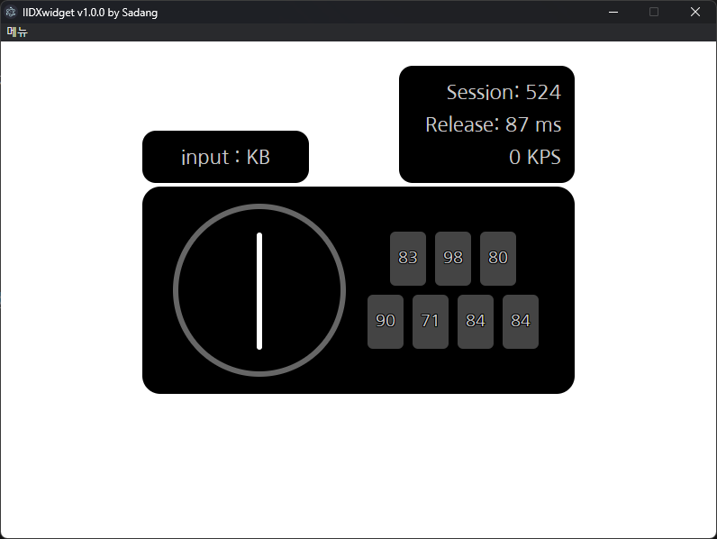

# IIDXwidget

🎵 **IIDXwidget**은  
[Rag](https://rag-oji.com/dakendisplay/) 님이 만든 방송용 투덱 위젯을 참고하여,  
**OBS 브라우저 소스**로 쉽게 불러올 수 있도록 개발한 **투덱 방송용 위젯 프로젝트**입니다.  
**투컴 방송** 환경에서도 사용할 수 있도록 설계되었습니다.

- **개발자** : [BMS Sadang](https://www.youtube.com/@Sadang)
- **라이센스** : MIT License

---

## 기능

- 스크래치의 입력 방향과 버튼 입력을 실시간으로 시각화하여 보여줍니다.
- 버튼이 눌렸다가 떼지는 데에 소요된 시간을 ms 단위로 측정하여 평균을 내줍니다. 현재 마지막 200회 입력에 대한 이동평균으로 설정되어 있습니다. (추후 커스터마이징 지원 예정)
---
## 사용 방법

1. 📦 설치 파일 실행  

   - Release에 업로드된 설치 파일을 다운로드하여 설치한 뒤 실행합니다.

2. 🌐 OBS에 브라우저 소스 추가

   - **원컴 방송**이라면:  
     `http://127.0.0.1:8080/widget/`
   - **투컴 방송**이라면:  
     `http://[리듬 게임 실행 컴퓨터의 IP]:8080/widget/`
   을 OBS의 **"브라우저 소스"**로 추가합니다.

3. 🎮 방송 시작
   - 즐겜하세요! 성과 많이 뽑으세요 😊

---

## 업데이트 이력

- 0.1.0 : 최초 릴리즈
---

## TODO

- 2P 지원
- PC 실행시 트레이로 자동 실행 기능 구현
- 원본 라그 위젯처럼 위젯 커스터마이징 기능 구현
- "설정" 스크린 구현하여 해당 스크린에 커스터마이징 기능 및 기타 등등 추가
- 위젯 실행 상태에서 컨트롤러가 뽑히는 경우에 대한 대책 마련 (현재는 종료 후 재실행이 대책입니다.)